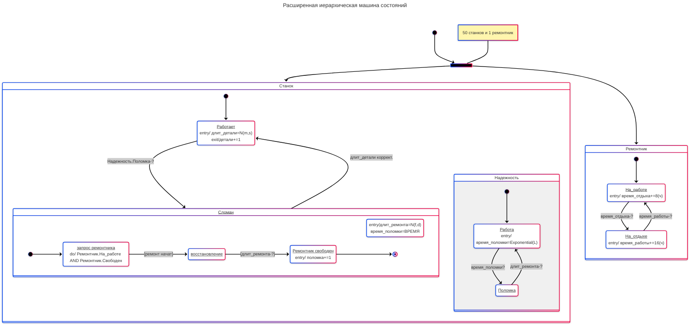
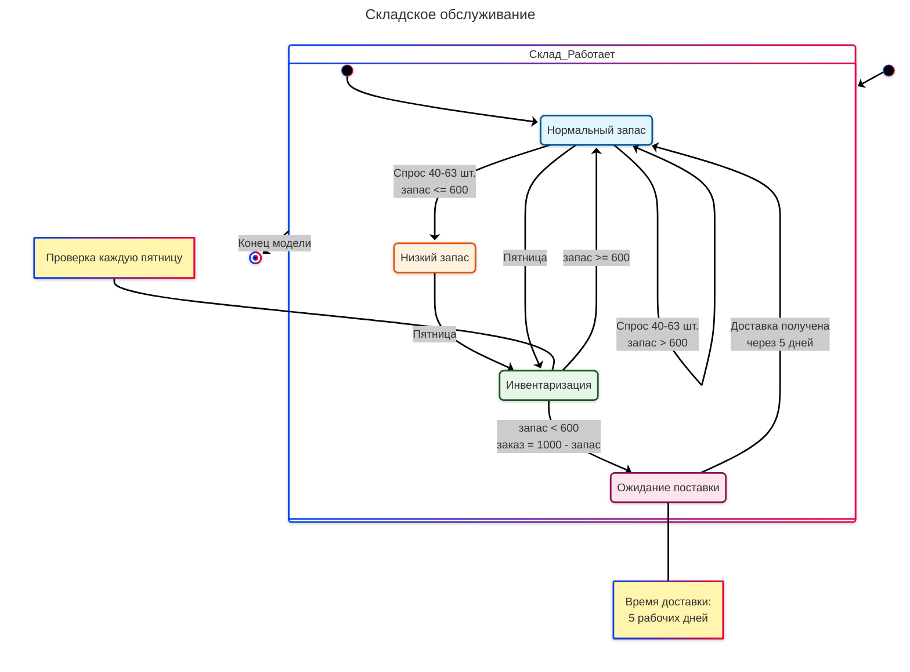

```mermaid
---
title: Расширенная иерархическая машина состояний
config:
  theme: neo
  look: neo
---
stateDiagram-v2
direction TB

state maintain<<fork>>
[*]--> maintain
maintain--> Станок
maintain--> Ремонтник

note left of maintain
  50 станков и 1 ремонтник
end note

%% === ОСНОВНОЙ БЛОК СТАНКА ===
state Станок{
    working:<u>Работает</u><br>entry/ длит_детали=N(m,s)<br>exit/детали+=1
    failed:<u>Сломан</u>
    
    [*]--> working
    working--> failed: Надежность.Поломка-?
    failed--> working: длит_детали коррект.
    
    %% ВЛОЖЕННЫЙ ПРЯМОУГОЛЬНИК "НАДЕЖНОСТЬ"
    state Надежность {
        work:<u>Работа</u><br>entry/ время_поломки=Exponential(L)
        Поломка:<u>Поломка</u>
        
        [*]--> work
        work--> Поломка: время_поломки?
        Поломка--> work: длит_ремонта-?
    }
}

%% === ПРОЦЕСС РЕМОНТА ===
state failed{
    ent: entry/длит_ремонта=N(f,d)<br>время_поломки=ВРЕМЯ
    request_fixer:<u>запрос ремонтника</u><br>do/ Ремонтник.На_работе AND Ремонтник.Свободен
    wait_repair:<u>восстановление</u>
    release_fixer:<u>Ремонтник свободен</u><br>entry/ поломка+=1
    
    direction LR
    [*]--> request_fixer
    request_fixer--> wait_repair: [ремонт начат]
    wait_repair--> release_fixer: [длит_ремонта-?]
    release_fixer-->[*]
}

%% === БЛОК РЕМОНТНИКА ===
state Ремонтник{
    startwork:<u>На_работе</u><br>entry/ время_отдыха+=8(ч)
    endwork:<u>На_отдыхе</u><br>entry/ время_работы+=16(ч)
    
    [*]--> startwork
    startwork--> endwork: время_отдыха-?
    endwork--> startwork: время_работы-?
}
```

```mermaid
---
title: Складское обслуживание
config:
  theme: neo
  look: neo
---
stateDiagram-v2
direction TB

[*]--> Склад_Работает

state Склад_Работает {
    direction LR
    
    state "Нормальный запас" as Normal
    state "Низкий запас" as Low
    state "Ожидание поставки" as Waiting
    state "Инвентаризация" as Inventory
    
    [*]--> Normal
    
    Normal--> Normal: Спрос 40-63 шт.<br>запас > 600
    Normal--> Low: Спрос 40-63 шт.<br>запас <= 600
    
    Low--> Inventory: Пятница
    Normal--> Inventory: Пятница
    
    Inventory--> Normal: запас >= 600
    Inventory--> Waiting: запас < 600<br>заказ = 1000 - запас
    
    Waiting--> Normal: Доставка получена<br>через 5 дней
    
    note right of Waiting
      Время доставки:<br>5 рабочих дней
    end note
    note left of Inventory
      Проверка каждую пятницу
    end note
}

Склад_Работает--> [*]: Конец модели

classDef normalState fill:#e1f5fe,stroke:#01579b
classDef lowState fill:#fff3e0,stroke:#e65100
classDef waitState fill:#fce4ec,stroke:#880e4f
classDef inventoryState fill:#e8f5e9,stroke:#1b5e20

class Normal normalState
class Low lowState
class Waiting waitState
class Inventory inventoryState
```
