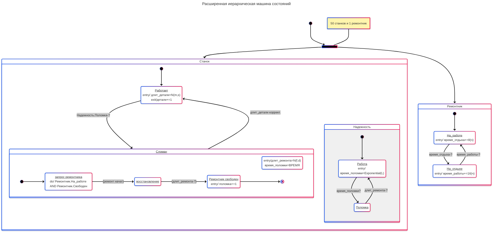
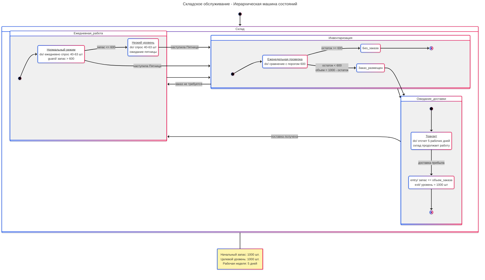

```mermaid
---
title: Расширенная иерархическая машина состояний
config:
  theme: neo
  look: neo
---
stateDiagram-v2
direction TB

state maintain<<fork>>
[*]--> maintain
maintain--> Станок
maintain--> Ремонтник

note left of maintain
  50 станков и 1 ремонтник
end note

%% === ОСНОВНОЙ БЛОК СТАНКА ===
state Станок{
    working:<u>Работает</u><br>entry/ длит_детали=N(m,s)<br>exit/детали+=1
    failed:<u>Сломан</u>
    
    [*]--> working
    working--> failed: Надежность.Поломка-?
    failed--> working: длит_детали коррект.
    
    %% ВЛОЖЕННЫЙ ПРЯМОУГОЛЬНИК "НАДЕЖНОСТЬ"
    state Надежность {
        work:<u>Работа</u><br>entry/ время_поломки=Exponential(L)
        Поломка:<u>Поломка</u>
        
        [*]--> work
        work--> Поломка: время_поломки?
        Поломка--> work: длит_ремонта-?
    }
}

%% === ПРОЦЕСС РЕМОНТА ===
state failed{
    ent: entry/длит_ремонта=N(f,d)<br>время_поломки=ВРЕМЯ
    request_fixer:<u>запрос ремонтника</u><br>do/ Ремонтник.На_работе AND Ремонтник.Свободен
    wait_repair:<u>восстановление</u>
    release_fixer:<u>Ремонтник свободен</u><br>entry/ поломка+=1
    
    direction LR
    [*]--> request_fixer
    request_fixer--> wait_repair: [ремонт начат]
    wait_repair--> release_fixer: [длит_ремонта-?]
    release_fixer-->[*]
}

%% === БЛОК РЕМОНТНИКА ===
state Ремонтник{
    startwork:<u>На_работе</u><br>entry/ время_отдыха+=8(ч)
    endwork:<u>На_отдыхе</u><br>entry/ время_работы+=16(ч)
    
    [*]--> startwork
    startwork--> endwork: время_отдыха-?
    endwork--> startwork: время_работы-?
}
```

```mermaid
---
title: Складское обслуживание - Иерархическая машина состояний
config:
  theme: neo
  look: neo
---
stateDiagram-v2
direction TB

[*] --> Склад

state Склад {
    direction LR

    %% === БЛОК 1: Ежедневная работа ===
    state Ежедневная_работа {
        [*] --> Нормальный_запас
        Нормальный_запас: <u>Нормальный режим</u><br>do/ ежедневно спрос 40-63 шт<br>guard/ запас > 600
        Нормальный_запас --> Низкий_запас: запас <= 600
        Низкий_запас: <u>Низкий уровень</u><br>do/ спрос 40-63 шт<br>ожидание пятницы
        Низкий_запас --> Инвентаризация: наступила Пятница
        Нормальный_запас --> Инвентаризация: наступила Пятница
    }

    %% === БЛОК 2: Инвентаризация (Пятница) ===
    state Инвентаризация {
        [*] --> Сверка_остатка
        Сверка_остатка: <u>Еженедельная проверка</u><br>do/ сравнение с порогом 600
        Сверка_остатка --> Без_заказа: остаток >= 600
        Сверка_остатка --> Заказ_размещен: остаток < 600<br>объем = 1000 - остаток
        Без_заказа --> [*]
        Заказ_размещен --> Ожидание_доставки
    }

    %% === БЛОК 3: Логистика ===
    state Ожидание_доставки {
        [*] --> В_пути
        В_пути: <u>Транзит</u><br>do/ отсчет 5 рабочих дней<br>склад продолжает работу
        В_пути --> Пополнение: доставка прибыла
        Пополнение: entry/ запас += объем_заказа<br>exit/ уровень = 1000 шт
        Пополнение --> [*]
    }

    %% Связи между вложенными состояниями
    Ежедневная_работа --> Инвентаризация
    Инвентаризация --> Ожидание_доставки
    Ожидание_доставки --> Ежедневная_работа: поставка получена
    Инвентаризация --> Ежедневная_работа: заказ не требуется
}

note right of Склад
  Начальный запас: 1000 шт.
  Целевой уровень: 1000 шт.
  Рабочая неделя: 5 дней
end note
```
